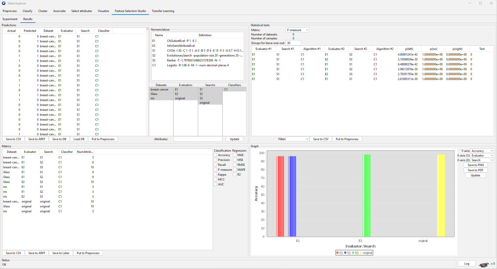

# Weka Feature Selection Studio
## A Feature Selection Studio plugin for Weka Explorer

New graphical user interface specifically designed to perform feature selection experiments in Weka Explorer allowing parallel computation. Predicted and actual values are produced in an exportable table, along with the desired attributes values. Moreover, an exportable table of evaluation metrics are also produced, in addition to a customizable bar plot.

Moreover, the CVOA optimization algorithm published [HERE](https://www.liebertpub.com/doi/10.1089/big.2020.0051) is also adapted in this plugin to search for attribute subsets, allowing its use along with any Weka attribute subset evaluation algorithm.

Developed by: **Andrés Manuel Chacón Maldonado** (for his final degree work)

Idea and supervision by: **Prof. Dr. Gualberto Asencio-Cortés** (final degree tutor)

2021 University of Pablo de Olavide. Seville, Spain

## Installation

1. Open the Package Manager of Weka (Tools menu in the first window).
2. Press the button File/URL
3. Write this address: https://github.com/gualbe/weka-feature-selection-studio/raw/main/fs-studio.zip
4. Press the OK button
5. Restart Weka

## User manual (in spanish)

https://github.com/gualbe/weka-feature-selection-studio/raw/main/FS-Studio%20Manual.pdf

## Screenshots

The Experiment panel:

The Results panel:

## Contact

Please contact with me at [My email](mailto:guaasecor@upo.es) if you have some comments or find some bugs.

Thank you!
