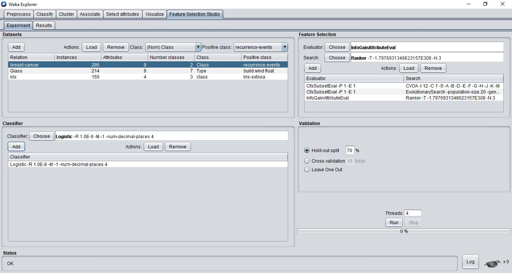
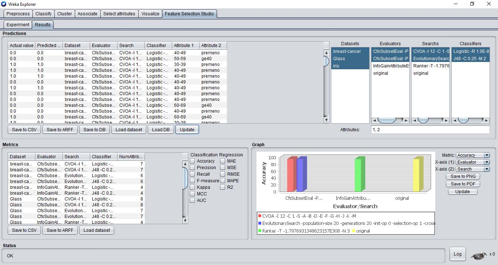

# Weka Feature Selection Studio
## A Feature Selection Studio plugin for Weka Explorer

Developed by: Andrés Manuel Chacón Maldonado (for his final degree work)

Idea and supervision by: Prof. Dr. Gualberto Asencio-Cortés (final degree tutor)

2021 University of Pablo de Olavide. Seville, Spain

## Screenshots

